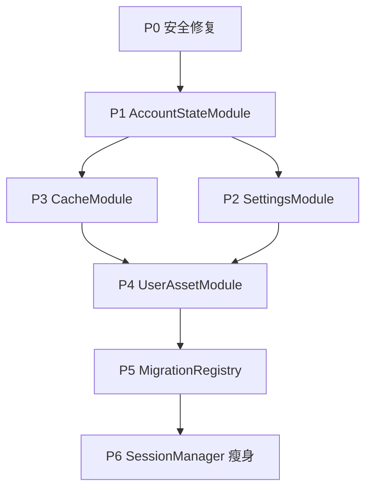

# M2 数据审计报告

## 审计目标

1. 遍历 `SessionManager` 所有 DataStore key，分类到目标 Module
2. 审计所有 Repository 对 `SessionManager` 的依赖关系
3. 识别跨账号污染风险点（缓存写入未检查 generation）
4. 记录迁移优先级和依赖顺序

---

## SessionManager DataStore Key 分类

### 凭据类（→ EncryptedCredentialStore，已迁移）
| Key | 说明 | 当前存储 | 目标 Module |
|---|---|---|---|
| `ENCRYPTED_*` | 所有加密凭据 | EncryptedCredentialStore | ✅ 已在正确位置 |

### 账号状态类（→ AccountStateModule）
| Key | 说明 | 当前存储 | 迁移优先级 |
|---|---|---|---|
| `JSESSIONID` | 门户会话 | DataStore 明文 | P1 高 |
| `JW_SESSION` | 教务会话 | DataStore 明文 | P1 高 |
| `JW_PST_SID` | 教务 PST | DataStore 明文 | P1 高 |
| `account_generation` | 账号代数 | 内存 AtomicLong | P1 高 |
| `last_login_time` | 最后登录时间 | DataStore | P1 中 |
| `cached_username` | 用户名内存缓存 | @Volatile | P1 高 |
| `cached_password` | 密码内存缓存 | @Volatile | P1 高 |

**风险点**：
- 会话 key 未与 generation 绑定，账号切换后可能残留
- 内存缓存在进程重启后失效，但 DataStore 中旧值仍在

### 应用设置类（→ SettingsModule）
| Key | 说明 | 当前存储 | 迁移优先级 |
|---|---|---|---|
| `theme_mode` | 主题模式 | DataStore | P2 高 |
| `dynamic_color_enabled` | 动态颜色 | DataStore | P2 中 |
| `bottom_nav_*` | 底栏配置（多个 key） | DataStore | P2 高 |
| `reminder_enabled` | 提醒总开关 | DataStore | P2 高 |
| `reminder_minutes_before` | 提前提醒分钟数 | DataStore | P2 高 |
| `schedule_show_weekends` | 课表显示周末 | DataStore | P2 中 |
| `schedule_show_section_time` | 显示节次时间 | DataStore | P2 中 |
| `schedule_color_mode` | 课程配色模式 | DataStore | P2 中 |
| `empty_classroom_preset` | 空教室预设 | DataStore | P2 低 |
| `market_enabled` | 集市开关 | DataStore | P2 中 |
| `chaoxing_enabled` | 学习通开关 | DataStore | P2 中 |
| `welearn_enabled` | WeLearn 开关 | DataStore | P2 中 |
| `show_study_overlay` | 学习悬浮窗 | 内存 @Volatile | P2 中 |

**聚合机会**：
- `schedule_*` 共 20+ 个独立 key，可聚合为 `ScheduleDisplaySettings` 数据类
- `*_enabled` 可统一为 `ThirdPartyService` enum

### 用户资产类（→ UserAssetModule）
| Key | 说明 | 当前存储 | 迁移优先级 |
|---|---|---|---|
| `course_note_*` | 课程备注 | DataStore | P4 高（已有接口） |
| `slot_note_*_*` | 节次备注 | DataStore | P4 高（已有接口） |
| `assessment_*` | 考核方案 | DataStore | P4 高（已有接口） |
| `todo_*` | 待办事项 | 未实现 | P4 低（未来） |
| `homework_*` | 作业记录 | 未实现 | P4 低（未来） |

**当前状态**：
- `AppDataStore` 已提供接口，但未纳入导出/导入体系
- 缺少 schema 版本和迁移策略

### 业务缓存类（→ CacheModule）

#### 课表缓存
| Key | 说明 | schema 版本 | 账号归属 | 迁移优先级 |
|---|---|---|---|---|
| `cached_courses_json` | 课表 JSON | ❌ 缺失 | ❌ 无检查 | P3 高 |
| `courses_last_updated` | 更新时间 | - | - | P3 高 |
| `selected_semester_id` | 当前学期 | - | ✅ 用户设置 | P2 中 |
| `semester_list_json` | 学期列表 | ❌ 缺失 | ❌ 无检查 | P3 高 |
| `semester_list_last_updated` | 更新时间 | - | - | P3 高 |

**风险点**：
- 账号切换后 `cached_courses_json` 未清理，导致 A 账号看到 B 账号课表

#### 成绩缓存
| Key | 说明 | schema 版本 | 账号归属 | 迁移优先级 |
|---|---|---|---|---|
| `cached_grades_json` | 成绩 JSON | ❌ 缺失 | ❌ 无检查 | P3 高 |
| `grades_last_updated` | 更新时间 | - | - | P3 高 |
| `cached_gpa_json` | GPA JSON | ❌ 缺失 | ❌ 无检查 | P3 中 |
| `gpa_last_updated` | 更新时间 | - | - | P3 中 |

#### 考试缓存
| Key | 说明 | schema 版本 | 账号归属 | 迁移优先级 |
|---|---|---|---|---|
| `cached_exams_json` | 考试 JSON | ❌ 缺失 | ❌ 无检查 | P3 高 |
| `exams_last_updated` | 更新时间 | - | - | P3 高 |

#### 一卡通缓存
| Key | 说明 | schema 版本 | 账号归属 | 迁移优先级 |
|---|---|---|---|---|
| `cached_transactions_json` | 账单 JSON | ❌ 缺失 | ❌ 无检查 | P3 高 |
| `transactions_last_updated` | 更新时间 | - | - | P3 高 |
| `ycard_qr_payload` | 支付码 payload | - | ✅ 有时效 | P1 高（敏感） |
| `ycard_qr_timestamp` | 支付码时间戳 | - | - | P1 高 |

**风险点**：
- `ycard_qr_payload` 应属于敏感凭据，当前在 DataStore 明文存储

#### 通知缓存
| Key | 说明 | schema 版本 | 账号归属 | 迁移优先级 |
|---|---|---|---|---|
| `cached_jwc_notices_json` | 教务通知 | ❌ 缺失 | ✅ 公开数据 | P3 中 |
| `jwc_notices_last_updated` | 更新时间 | - | - | P3 中 |
| `cached_xzxx_notices_json` | 学工通知 | ❌ 缺失 | ✅ 公开数据 | P3 中 |
| `xzxx_notices_last_updated` | 更新时间 | - | - | P3 中 |

#### 天气缓存
| Key | 说明 | schema 版本 | 账号归属 | 迁移优先级 |
|---|---|---|---|---|
| `cached_weather_json` | 天气 JSON | ❌ 缺失 | ✅ 公开数据 | P3 低 |
| `weather_last_updated` | 更新时间 | - | - | P3 低 |

#### 学生信息缓存
| Key | 说明 | schema 版本 | 账号归属 | 迁移优先级 |
|---|---|---|---|---|
| `cached_student_info_json` | 学生信息 | ❌ 缺失 | ❌ 无检查 | P3 高（敏感） |
| `student_info_last_updated` | 更新时间 | - | - | P3 高 |

**风险点**：
- 学生信息包含姓名、学号、身份证号，应与账号强绑定
- 账号切换后必须立即清理

### 其他杂项
| Key | 说明 | 当前存储 | 处理方式 |
|---|---|---|---|
| `first_login_init_done` | 首次初始化标记 | 内存 @Volatile | 保留（临时状态） |
| `guide_intro_seen` | 使用指南已看 | DataStore | 保留（退登不清） |
| `announcement_ignored_ids` | 忽略的公告 | DataStore | 保留（退登不清） |
| `legal_consent_version` | 隐私政策版本 | DataStore | 保留（法律要求） |

---

## Repository 依赖关系审计

### 直接依赖 SessionManager 的 Repository（46 个）

#### 核心认证层（7 个）
1. `CasAuthRepository` - 读写：username, password, JSESSIONID
2. `JwAuthRepository` - 读写：JW_SESSION, JW_PST_SID
3. `JwAppAuthRepository` - 读写：jwapp_username, jwapp_token
4. `ChaoxingRepository` - 读写：chaoxing_cookies
5. `WeLearnAuthRepository` - 读写：welearn_cookies
6. `CProgAuthRepository` - 读写：cprog_jwt
7. `MarketRepository` - 读写：market_identities

**依赖分析**：
- 全部需要 AccountStateModule 的凭据读写接口
- 部分需要 generation 检查防止跨账号污染

#### 业务数据层（20 个）
1. `CourseRepository` - 读写：courses_json, semester_id
2. `GradeRepository` - 读写：grades_json, gpa_json
3. `ExamRepository` - 读写：exams_json
4. `CardRepository` - 读写：transactions_json
5. `YcardRepository` - 读写：ycard_qr_payload
6. `StudentInfoRepository` - 读写：student_info_json
7. `FinanceRepository` - 读写：finance_json
8. `TrainingPlanRepository` - 读写：training_plan_json
9. `ProgramCompletionRepository` - 读写：program_completion_json
10. `EmptyClassroomRepository` - 读写：empty_classroom_json
11. `EvaluationRepository` - 读写：evaluation_jwt, evaluation_json
12. `JwcNoticeRepository` - 读写：jwc_notices_json
13. `XzxxRepository` - 读写：xzxx_notices_json
14. `WeatherRepository` - 读写：weather_json
15. `KqAttendanceRepository` - 读写：attendance_json
16. `AdwmhCardRepository` - 读写：adwmh_balance_json
17. `AnnouncementRepository` - 读：announcement_ignored_ids
18. `ChaoxingStudyRepository` - 读：chaoxing_cookies
19. `WeLearnStudyRepository` - 读：welearn_cookies
20. `CProgRepository` - 读写：cprog_practice_json

**依赖分析**：
- 全部需要 CacheModule 的读写接口
- 写入时必须检查 generation 防止旧请求污染

#### 设置相关（5 个）
1. `CourseNoteRepository` - 读写：course_note_*, slot_note_*
2. `AssessmentRepository` - 读写：assessment_*
3. `UserTaskRepository` - 读写：todo_* (未来)
4. `HomeworkRepository` - 读写：homework_* (未来)
5. `RoomCourseTableRepository` - 读：selected_semester_id

**依赖分析**：
- CourseNoteRepository 已独立，但需纳入 UserAssetModule
- 其他需等待对应 Module 实现

#### 诊断与维护（3 个）
1. `DeveloperCacheRepository` - 读：所有缓存 key
2. `DeveloperOverviewRepository` - 读：账号状态、设置
3. `CacheCleanupRepository` - 写：清理缓存

**依赖分析**：
- 需要各 Module 暴露诊断接口
- 清理逻辑需委托给各 Module

---

## 跨账号污染风险点

### 高风险（需立即修复）

1. **课表缓存写入未检查 generation**
   ```kotlin
   // CourseRepository.fetchCourses() 写入缓存时
   // ❌ 没有检查是否是当前账号的请求
   sessionManager.saveCachedCourses(courses)
   ```
   **影响**：A 账号退出 → B 账号登录 → A 账号的旧请求返回 → B 账号看到 A 的课表

2. **成绩缓存同理**
   ```kotlin
   // GradeRepository.fetchGrades()
   sessionManager.saveCachedGrades(grades)
   ```

3. **学生信息缓存**
   ```kotlin
   // StudentInfoRepository.fetchStudentInfo()
   sessionManager.saveCachedStudentInfo(info)  // 包含姓名、学号、身份证
   ```

### 中风险（需评估）

4. **支付码 payload 明文存储**
   - 当前在 DataStore，应移至 EncryptedCredentialStore
   - 虽有时效性，但仍属敏感信息

5. **集市多身份切换**
   - `MarketRepository` 支持多身份，但缓存未按身份隔离
   - 切换身份后可能看到上个身份的数据

### 低风险（可延后处理）

6. **公开数据缓存**
   - 通知、天气等公开数据即使跨账号也无敏感性
   - 但逻辑上仍应清理，避免困惑

---

## 迁移优先级排序

### P0 - 安全修复（立即）
1. 学生信息缓存 generation 检查
2. 支付码 payload 迁移到加密存储

### P1 - 账号状态（Week 2）
1. AccountStateModule 实现
2. 凭据读写迁移
3. generation 机制深化
4. 会话清理策略

### P2 - 应用设置（Week 3）
1. SettingsModule 实现
2. 课表显示设置聚合
3. 第三方开关统一
4. 底栏配置迁移

### P3 - 业务缓存（Week 4）
1. CacheModule 实现
2. 课表缓存迁移（含 generation 检查）
3. 成绩缓存迁移
4. 考试缓存迁移
5. 一卡通缓存迁移
6. 其他业务缓存

### P4 - 用户资产（Week 5-6）
1. UserAssetModule 实现
2. 备份格式设计
3. 导出/导入 UI
4. 安全审计

---

## 依赖顺序



---

## 下一步行动

### 本周（Week 1）
- [ ] 完成 Phase 0.1：黄金快照收集
- [ ] 完成 Phase 0.2：本审计报告
- [ ] 完成 Phase 0.3：Module 接口设计

### 下周（Week 2）
- [ ] 紧急修复 P0 安全问题
- [ ] 开始 P1 AccountStateModule 实现

---

## 附录：SessionManager 代码结构

### 当前行数分布（4035 行）
- 变量声明与初始化：~200 行
- 凭据读写方法：~300 行
- 账号状态方法：~150 行
- 设置读写方法：~800 行
- 缓存读写方法：~1500 行
- 用户资产方法：~200 行
- 清理方法：~100 行
- 辅助函数：~200 行
- 空行与注释：~585 行

### 目标行数（< 800 行）
- 门面方法（委托）：~300 行
- 账号协调逻辑：~150 行
- 初始化与迁移：~100 行
- 兼容代码（临时）：~150 行
- 空行与注释：~100 行
